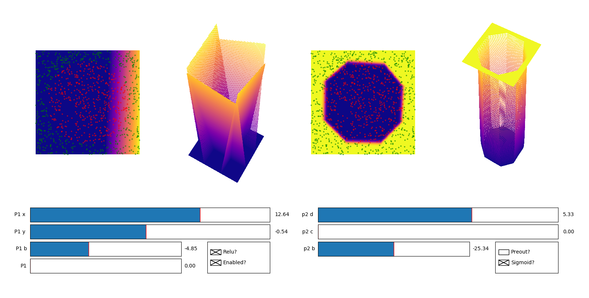
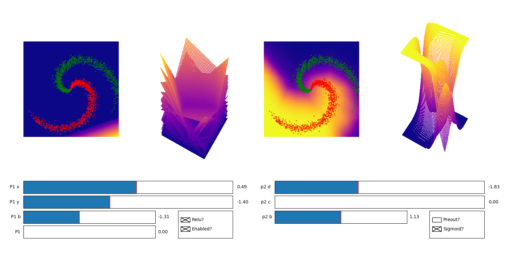
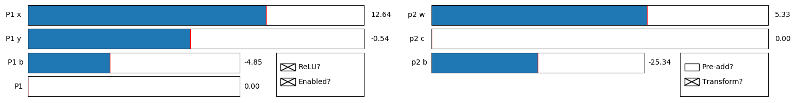

# 2-layer Network Visualisation

A python application demonstrating how a 2-layer fully connected network with rectified
linear units in the hidden layer interacts with the feature-space of a dataset.

### Required Libraries
- Numpy
- Matplotlib

### Datasets
The application currently supports 2 features datasets with 2 classes max.
Implemented datasets:
- Circle: Uses a network trained with a sigmoid output


- Spiral: Uses a network trained with a softmax output


### Running the application
To run the application you need:
 - to clone this repo
 - add `from NetworkVisualisation import NetworkVisualisation` to your file
 - Create a `NetworkVisualisation` object
 - Call the `show()` method.

**Circle Dataset Sigmoid Network Example**
```python
vis = NetworkVisualisation(units=5, data_points=1000, min_range=-1, max_range=1, quality=100, saves_path="resources/saves", dataset=Dataset.CIRCLE)
vis.show()
```

**Spiral Dataset Softmax Network Example**
```python
vis = NetworkVisualisation(units=24, data_points=1000, min_range=-1, max_range=1, quality=100, saves_path="resources/saves", dataset=Dataset.SPIRAL)
vis.show()
```

**`NetworkVisualisation` Parameters:**
- units: The amount of neurons in the hidden layer of the network
- data_points: The amount of data points sampled from the dataset
- min_range: The smallest dimensional value shown on the plots. (how much of the feature-space you see)
- max_range: The largest dimensional value shown on the plots. (how much of the feature-space you see)
- quality: The resolution of the plots. Larger values will slow down the application
- dataset: The dataset enum. Dataset.CIRCLE or Dataset.SPIRAL
- saves_path: Optional. This is so you don't have to retrain your network every time before the visualisation.
- seed: Optional, The random seed used to sample network parameters.

### Using the GUI


The application offers an interface for adjusting network parameters through a series of sliders and check boxes.
You can also change the viewing angle of the 3d plots by clicking and dragging.

**GUI Layout**<br>
The layout is setup in two halves. The left half represents configuration of neurons in the hidden layer.
And the right half represents the configuration of the output neuron.
<br>
There are 4 plots. The plots are generated by sampling points from the feature-space, and generating outputs from a neuron/network. A heat map is used to show high(yellow) vs low(blue) output values.
<br>
<br>
**Plots** 
- Plot 1 shows the feature-space outputs from one of the neurons in the hidden layer. The output dimension is flattened.
- Plot 2 shows all the hyperplanes generated from the outputs of the neurons in the hidden layer.
- Plot 3 shows the feature-space outputs from the entire network. Again with the output dimension flattened.
- Plot 4 shows the same as plot 3 but in 3D space.

**Slider Descriptions:**<br>
The sliders on the left half of the GUI correspond to the currently selected neuron, which is displayed in far left plot.
- P1 x: The input connection weight for the x dimension feature to the selected neuron from the hidden layer.
- P1 y: The input connection weight for the y dimension feature to the selected neuron from the hidden layer.
- P1 b: The bias of the selected neuron from the hidden layer.
- P1: The currently selected neuron from the hidden layer.
- P2 w: The current connection weight.
- P2 c: The current connection selected from the hidden layer neuron to the output neuron.
- P2 b: The output neuron bias.

**Checkbox Descriptions:**
- ReLU?: Whether he first two plots will show the hidden layer outputs with/without the ReLU function applied.
- Enabled?: Whether the current hidden layer neuron should be used.
- Pre-add?: If enabled then the right side plots will show the hidden layer hyperplanes after they have been multiplied by the output neuron connection weights, but before they are all added together. If enabled then "Transform? will have no effect."
- Transform?: Whether the right side plots should show the output neurons output before or after the transform (Checked is after).


